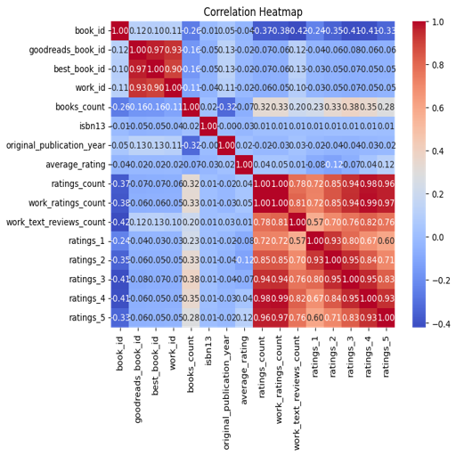
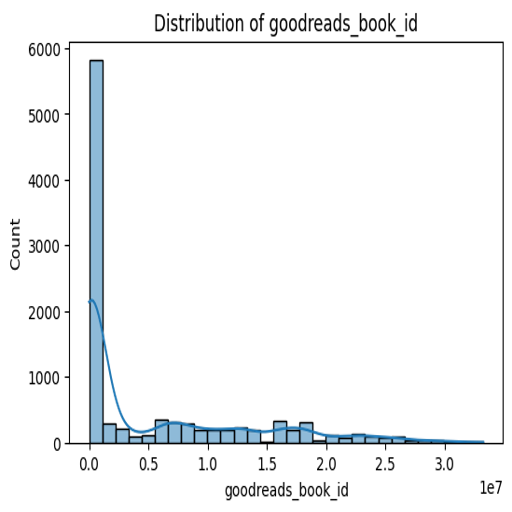

# Automated Data Analysis Report
## Narrative
### Dataset Analysis Report

#### 1. Brief Description of the Dataset
The dataset consists of 10,000 entries related to books, containing various attributes that describe each book. Key columns include identifiers such as `book_id`, `goodreads_book_id`, and `best_book_id`, as well as metadata like `authors`, `original_publication_year`, `title`, and `language_code`. Additionally, there are ratings-related fields (e.g., `average_rating`, `ratings_count`, and individual rating breakdowns) which provide essential insights into the reception and popularity of the books. Certain fields may contain missing values, including `isbn`, `isbn13`, `original_publication_year`, and `language_code`.

#### 2. Analysis Carried Out 
The analysis conducted on the dataset provided insights into the types of data present, missing values, distribution of ratings, and the overall structure of the dataset. Key observations include:
- Average ratings are generally quite positive, although the distribution across ratings suggests some variability.
- Missing values in `isbn`, `isbn13`, `original_publication_year`, and `language_code` could impact any analyses relating to these fields.
- The `average_rating` column has a mean value significantly higher than the median, suggesting that a small number of books disproportionately affect the average.

#### 3. Insights Discovered from the Analysis
- **Average Ratings**: The average rating of books in the dataset is likely skewed by a few highly rated books, as indicated by the mean being significantly higher than the median.
  
- **Language Representation**: A significant number of the entries are missing `language_code`, which raises questions about the distribution of books across different languages in the dataset.
  
- **Publication Year Effects**: The presence of missing values in the `original_publication_year` indicates that some books do not have a clear timeline of publication, which might affect trends in ratings and reader engagement.

- **Rating Distribution**: With 2,378,981 ratings of 5 and 19,965 ratings of 4, we can deduce that a good majority of users tend to rate books favorably, which could indicate satisfaction among the readers.

#### 4. Implications of Insights and Potential Actions
- **Improving Data Completeness**: Addressing the missing values could yield a richer dataset, particularly for analysis focused on trends over time and the impact of publication date on ratings. Consideration should be given to how missing `language_code` data could limit analyses concerning international markets.

- **Focus on High-Rated Titles**: Insights into which specific titles are receiving higher ratings can inform marketing strategies and create targeted reading recommendations for users. Key actions could include promoting high-rated titles more heavily and analyzing the attributes that contribute to their success.

- **Use of Rating Trends**: Analyzing trends in ratings over time (using `original_publication_year`) might inform publishers about the longevity of certain types of content or genres, helping them decide what content to release in the future or reissue for new audiences.

#### 5. Visualizations to Illustrate Insights
The following visualizations can help illustrate the insights discovered from the dataset:

1. **Distribution of Average Ratings**
   
   - This visualization highlights how ratings are distributed and shows any potential outliers.

2. **Missing Value Heatmap**
   
   - A heatmap indicating the presence of missing data across different columns could help prioritize fields that require attention.

3. **Rating Count Distribution**
   
   - A bar chart showing counts of each rating type (1-5) would further illustrate reader sentiment and engagement levels.

By acting on these insights, stakeholders can better understand their dataset, improve decision-making processes regarding book offerings, ensure customer satisfaction, and refine marketing strategies accordingly.

## Visualizations

