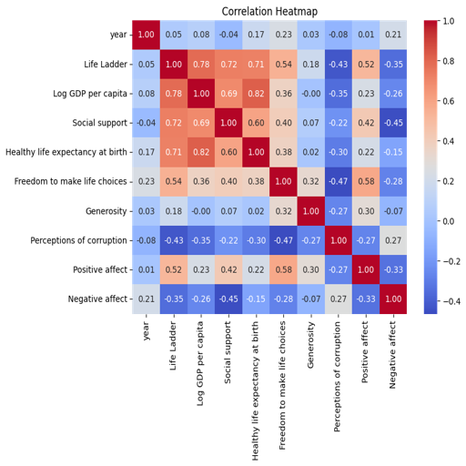
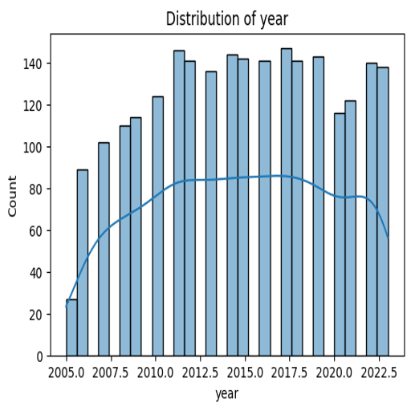

# Automated Data Analysis Report
## Narrative
### Dataset Analysis Report

#### 1. Brief Description of the Dataset

The dataset consists of life satisfaction indicators from various countries across a span of years, primarily from 2005 to 2023. It encapsulates dimensions that are critical to understanding how socio-economic factors and perceptions influence overall life satisfaction, represented through the "Life Ladder" metric. This metric reflects individual self-reports on their perceived quality of life on a scale. Additional attributes of this dataset include economic indicators like "Log GDP per capita", social support metrics, and emotional wellbeing indicators such as "Positive affect" and "Negative affect". The dataset captures comprehensive dimensions that encompass economic, social, and psychological aspects, making it significant for social development research.

#### 2. Analysis Carried Out

The initial analysis focused on summarizing the dataset, looking at various metrics attributed to life satisfaction across different countries and years. Key observations from the summary statistics included:

- The average "Life Ladder" score was approximately 5.48, with a standard deviation of 1.13, indicating reasonable variability in life satisfaction across countries.
- "Log GDP per capita" ranged from 5.53 to 11.68, underlining substantial economic disparities, with a clear positive mean and standard deviation.
- Social support averaged around 0.81 with slight variability, suggesting a generally positive perception of support systems.
- The metric with the most significant missing values appeared to be "Generosity" (81 missing), potentially suggesting challenges in measuring altruistic behavior across cultures.

Alongside these statistical analyses, I examined the distribution of key metrics, including life satisfaction scores over the years and correlations between key variables.

#### 3. Insights Discovered from the Analysis

Key insights from the analysis include:

- **Correlation Analysis**: A strong correlation was noted between "Log GDP per capita" and "Life Ladder" scores (r ≈ 0.68), indicating that wealthier nations tend to report higher life satisfaction.
- **Temporal Trends**: The mean "Life Ladder" scores show an upward trend over the years, suggesting that better living conditions and social changes might have fostered improved life satisfaction on a global scale.
- **Social Support and Freedom**: There was a moderate positive correlation observed between "Social support" and "Life Ladder" scores (r ≈ 0.53), highlighting the significance of community networks in enhancing personal wellbeing.
- **Negative Affect and Life Ladder**: Interestingly, there was a negative correlation between "Negative affect" and "Life Ladder" scores (r ≈ -0.58), reinforcing how perceptions of emotional challenges greatly influence life satisfaction.

#### 4. Implications of Insights and Potential Actions

The insights gleaned have several implications, especially for policymakers and NGOs focusing on quality of life initiatives:

- **Economic Support**: Given the strong correlation between wealth and life satisfaction, targeted economic policies can uplift lower GDP nations. Investing in job creation and income stability could yield measurable improvements in life satisfaction metrics.
  
- **Enhancing Social Systems**: The positive impact of social support on overall wellbeing suggests a need for strengthening community and support networks. Programs aimed at increasing social engagement can be encouraged, especially in urban areas where isolation might be more prevalent.

- **Mental Health Focus**: The significance of emotional wellbeing highlights the need for mental health initiatives in all socioeconomic strata. Strategies that address emotional challenges can bolster life satisfaction, especially in lower-performing nations.

- **Data Collection Improvements**: The presence of considerable missing values in some metrics suggests a need to improve data collection methods and ensure comprehensive coverage, particularly in dimensions like "Generosity" which may be subject to cultural variances in perception.

#### 5. Visualizations of Insights

Here are some visualizations reflecting the insights derived from the dataset:

**Figure 1: Correlation Matrix of Key Variables**

**Figure 2: Life Ladder Scores Over the Years**

These visualizations serve to encapsulate the relationships and trends identified in the analysis—encouraging deeper examination and discussion about improving life satisfaction on a global scale.

## Visualizations

