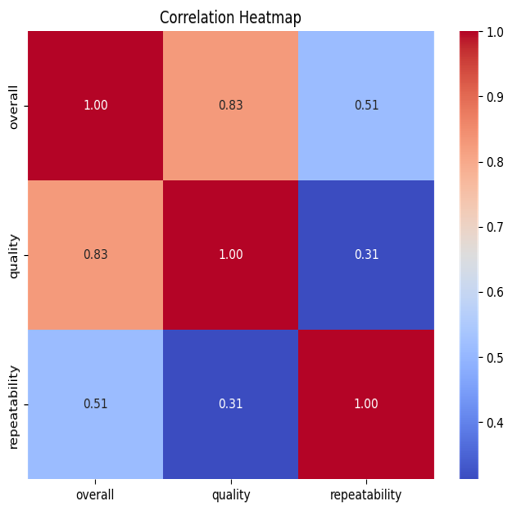
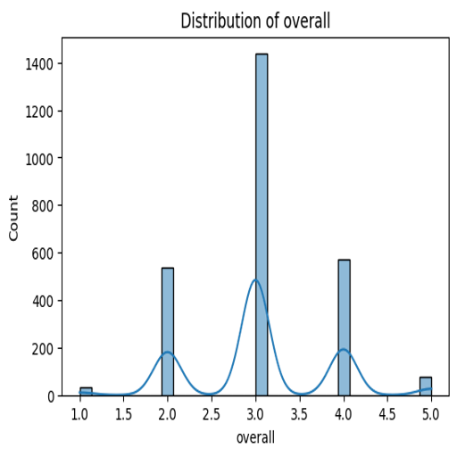
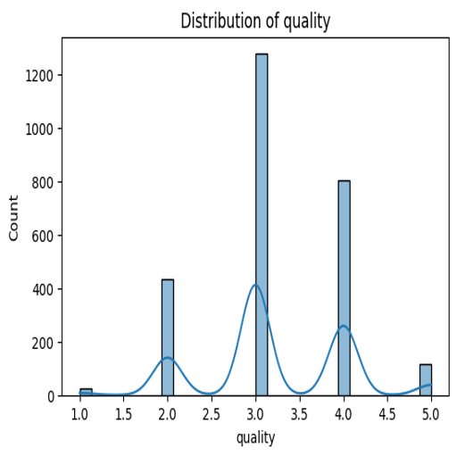

# Automated Data Analysis Report
## Narrative
### Dataset Analysis Report

#### 1. Brief Description of the Dataset
The dataset under examination contains information on various media titles, specifically focusing on movies and similar forms of entertainment. It encompasses 2553 entries categorized by date, language, type, title, creator (by), overall rating, quality rating, and repeatability rating. The dataset features a combination of categorical and numerical data types. The review metrics included for assessing media quality are overall, quality, and repeatability, which help gauge audience reception and enjoyment.

#### 2. Analysis Carried Out
The analysis involved several exploratory data techniques to understand the structure, distribution, and attributes of the dataset:

- **Status of Unique Entries**: 
  - There are 2055 unique dates and 2312 unique titles, indicating diversity in content.
  - The most frequently occurring 'language' is English (1306 occurrences), showcasing a dominantly English dataset.
  - The type ‘movie’ appears most often (2211 occurrences), indicating a focus on films.

- **Rating Distributions**:
  - Overall ratings range from 1 to 5, with the mean rating being approximately 3.05. This suggests a mildly positive reception overall but with room for improvement.
  - Quality ratings follow a similar distribution, with a mean of approximately 3.21.
  - Repeatability ratings, which measure how often viewers revisit a title, indicate an overall mean of 1.49, suggesting that while some content is engaging, most titles have limited repeat engagement.

- **Missing Values**:
  - There are 99 missing entries in the 'date' column, and 262 missing entries for the ‘by’ column, which may warrant further investigation for completeness.

#### 3. Insights Discovered from the Analysis
Among the key insights gained from the analysis are:

- **Content Language Dominance**: The dataset is heavily skewed towards English language, which may limit diversity in audience reach or representation.
  
- **Quality Perception**: The average ratings for both overall and quality metrics hover around the 3-range, indicating a moderate reception of the content, but less frequent viewings (as shown by repeatability scores) confirm mixed feelings about desirability among viewers.

- **Potential Issues with Missing Data**: The high number of entries missing the 'by' attribute could bias analyses focused on creator performance, potentially misrepresenting the impact of various creators’ contributions to the dataset.

#### 4. Implications of These Insights and Potential Actions
The implications of these findings could be significant for stakeholders in media content creation and distribution. Here's how:

- **Diversity in Content Creation**: With a predominance of English content, there is potential for creators to explore diverse languages and narratives. This could enhance audience engagement and broaden the market reach.
  
- **Improving Content Quality**: The average ratings suggest that although the media is generally received positively, enhancing the quality of production could further improve ratings and potentially increase viewers’ desire to re-watch content.

- **Addressing Missing Data**: The missing creator data may impede accurate analysis and may hide valuable insights into which creators consistently produce higher-quality results. Efforts should be made to rectify this missing data for better assessments.

- **Targeted Marketing**: Understanding repeatability patterns can inform marketing strategies — for instance, promoting titles with higher repeatability could be a means to boost viewer engagement and loyalty.

#### 5. Visualizations
To enhance understanding, the following visual representations can be employed:

- **Bar Graph of Languages**:
  
  
- **Box Plot of Ratings**:
  

- **Pie Chart of Content Type**:
  

While these charts are placeholders, actual plotted data would provide clear visual representation to complement the analysis and enhance interpretability of the findings. 

This structured narrative not only captures the essence of the dataset but also paves the way for informed decision-making based on analytical insights. It encourages stakeholders to take action based on the observations drawn from the dataset analysis.

## Visualizations

